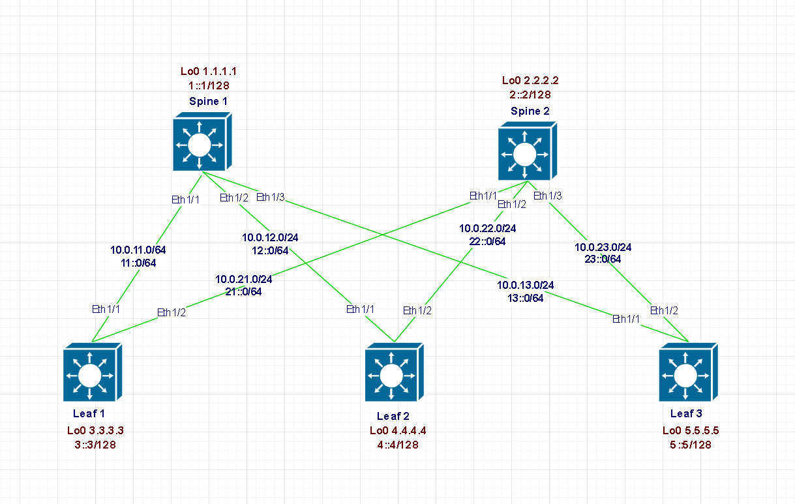

## 1. Цели
* Настроить IS-IS в Underlay сети, для IP связанности между всеми устройствами NXOS;

#### Схема сети



<details> 

<summary> Теория </summary>

```

Различия с OSPF:
1. Зона
  1. OSPF – граница проходит через маршрутизатор
  2. IS-IS – граница проходит через интерфейс
2. Построение топологии
  1. OSPF – сложный (7 этапов)
  2. IS-IS – простой (Down - Init(Two-way OSPF) - UP)
3. Транспорт
  1. OSPF – IP
  2. IS-IS – 802.3

IS-IS. Concept. L1
• Есть маршрутная информация только о своей зоне
• L1 Возможен только в рамках одной зоны
• Для выхода из своей зоны необходимо отправить трафик к маршрутизатору L2
• Аналог Stub Area в OSPF


IS-IS. Concept. L2
• Есть маршрутная информация о нескольких зонах
• L2 отношения возможны как внутри зоны, так и между
• L2 зона должна быть непрерывны – Backbone (area0 OSPF)
• Для L2 отдельная таблица LSDB
• Cisco по умолчанию использует смешанный режим – L1/L2

```

</details>

## 2. Адресное пространство для Underlay сети:

#### Адресация интерфейсов на Spine и Leaf:

| Наименование |   Адрес IPv4   | Адрес IPv6 |    Интерфейс    |
| :----------- |:--------------:| :--------: |  :------------: |
| Spine1       |  10.0.11.1/64  |   11::1/6  |    Ethernet1/1  |
| Spine1       |  10.0.12.1/64  |   12::1/6  |    Ethernet1/2  |
| Spine1       |  10.0.13.1/64  |   13::1/6  |    Ethernet1/3  | 
| Spine2       |  10.0.21.1/64  |   21::1/6  |    Ethernet1/1  |
| Spine2       |  10.0.22.1/64  |   22::1/6  |    Ethernet1/2  |
| Spine2       |  10.0.23.1/64  |   23::1/6  |    Ethernet1/3  | 
| Leaf1        |  10.0.11.2/64  |   11::2/6  |    Ethernet1/1  |
| Leaf1        |  10.0.21.2/64  |   21::2/6  |    Ethernet1/2  |
| Leaf2        |  10.0.12.2/64  |   12::2/6  |    Ethernet1/1  |
| Leaf2        |  10.0.22.2/64  |   22::2/6  |    Ethernet1/2  |
| Leaf3        |  10.0.13.2/64  |   13::2/6  |    Ethernet1/1  |
| Leaf3        |  10.0.23.2/64  |   23::2/6  |    Ethernet1/2  |

#### Анонсируемые сети:

| Наименование | Rouer ID |              Анонсируемые сети          |
| :----------- |:--------:| :--------------------------------------:|
| Spine1       |  1.1.1.1 | 10.0.0.0/30, 10.0.0.8/30, 10.0.0.16/30  |
| Spine2       |  2.2.2.2 | 10.0.0.4/30, 10.0.0.12/30, 10.0.0.20/30 |
| Leaf1        |  3.3.3.3 | 10.0.0.0/30, 10.0.0.4/30                |
| Leaf2        |  4.4.4.4 | 10.0.0.8/30, 10.0.0.12/30               |
| Leaf3        |  5.5.5.5 | 10.0.0.16/30, 10.0.0.20/30              |

#### Настройка Spine1:
